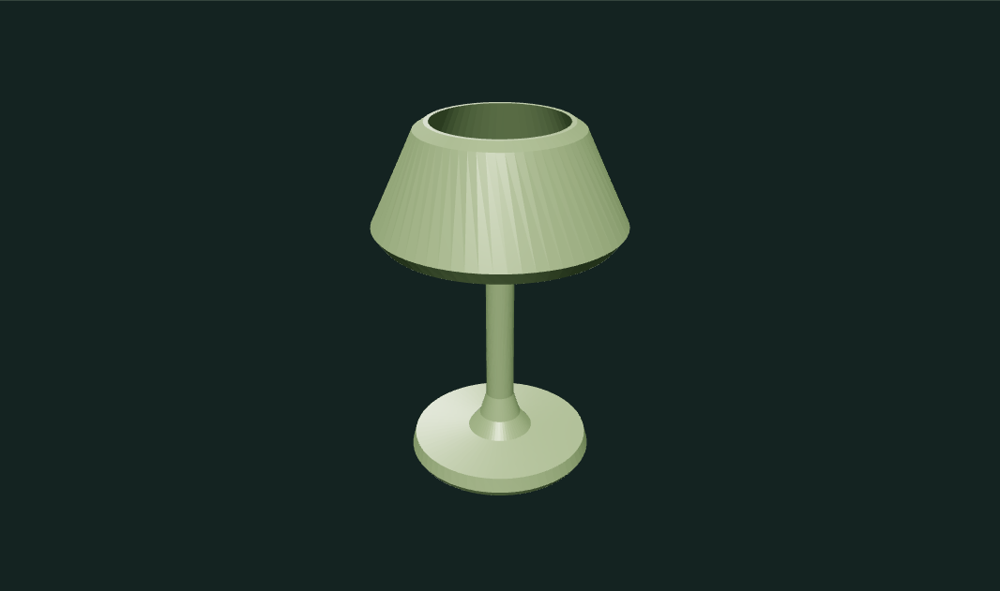
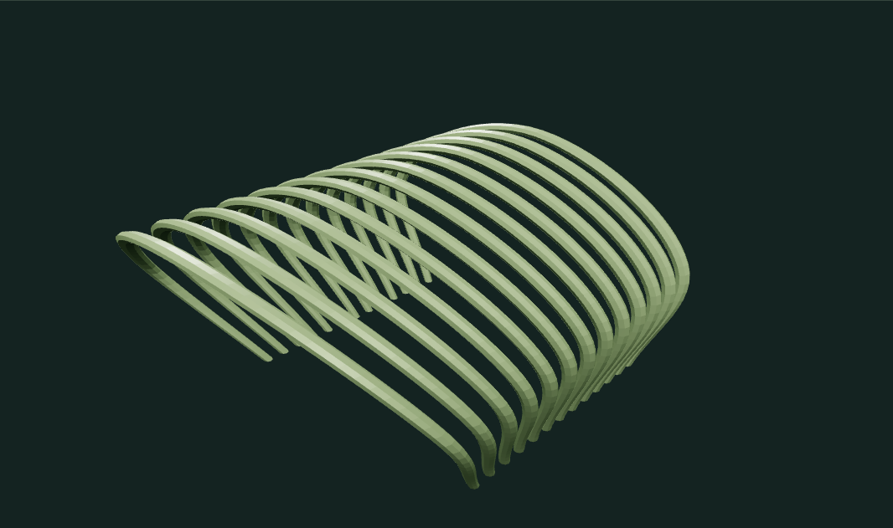

# Procedural shape builder

A small browser geometry editor: connect source shapes and mesh operations, change parameters, and export the resulting mesh or editable graph.

[Open the live tool](https://zachsm.com/experiments/procedural-shape-builder)




## Run locally

Node 22 or later:

```sh
npm ci
npm run dev
npm test
npm run build
```

The portfolio and standalone app both import `createExperiment` from `src/index.js`. Three.js renders the mesh; the shared GraphicsWorkbench supplies camera controls, accessible form controls, cleanup, and PNG snapshots. The geometry graph itself lives here.

## What works

- Source nodes: lathe profiles, curved tube profiles, and subdivided boxes.
- Connections and operations: translation, repetition, twist, taper, bend, and combination.
- Select nodes, edit their parameters, connect new operations, reconnect inputs, remove the final operation, and undo edits.
- Three independent starting graphs: turned lamp, spiral staircase, and ribbed pavilion.
- Export an OBJ mesh, a viewport PNG, or graph JSON. Import graph JSON and rebuild it locally.
- Cycles, missing inputs, nonfinite coordinates, oversized profiles, and excessive expansion are rejected.

The bend maps both a vertex's height and its offset from the neutral axis into a circular coordinate frame. Twist preserves radial distance. Repetition creates actual mesh copies; the displayed triangle count comes from evaluated geometry.

## Scope and limits

This is an acyclic geometry graph, not a full CAD system. The compact interface shows connections as named inputs instead of a free-position node canvas. Preset profiles can be edited in exported JSON; the UI edits modifier parameters. Combined pieces are not Boolean-unioned. Extreme bends can self-intersect, and normals are recomputed after deformation. No server receives uploaded graphs.

Evaluation is bounded to 40 nodes, 128 profile points, 600,000 output vertices, and 150 KB imported JSON files. It runs synchronously, so larger valid graphs can take longer to rebuild. A Web Worker would be the next step for higher budgets.

## Verification

`npm test` verifies finite preset geometry, repetition counts, twist radius preservation, the bend coordinate mapping, cycle rejection, and input bounds. Browser checks exercised graph changes, actual OBJ export (39,936 vertices / 13,312 triangles for the pavilion example), and a 390px viewport without horizontal overflow. Example steps are recorded in `examples/manifest.json`.

No GitHub Actions are configured. Run tests locally before publishing.

## Run and explore

[Open the portfolio demo](https://zachsm.com/experiments/procedural-shape-builder). This repository runs independently and exports the same implementation used by the portfolio.

Requires Node.js 22 or later.

```sh
npm ci
npm test
npm run dev
```

`npm run build` produces a static site in `dist`. Editing, uploaded files, and exports stay in the browser. No account, server processing, or GitHub Actions is required.

## Captured examples


Turned lamp · a 64-segment lathe profile.


Ribbed pavilion · thirteen curves with a 0.65 taper.

Exact reproduction steps are recorded in [the example manifest](examples/manifest.json).
